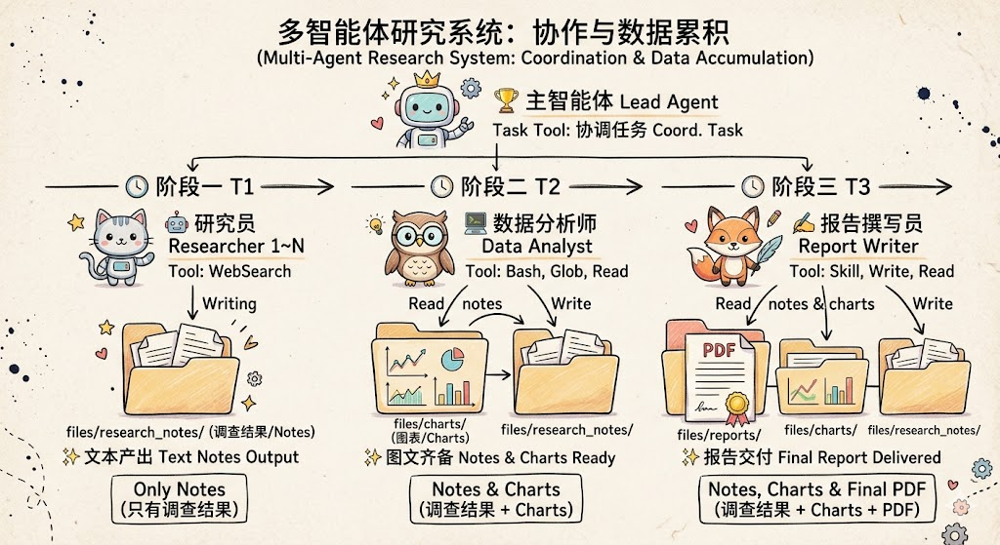

# DeepResearch Agent

DeepResearch Agent 是一个基于多智能体的研究助手，通过搜索、收集、分析各种来源的信息(如网页、数据库、文档等)，将这些信息整理为带有可视化图表的深度研究报告，以支持复杂的研究和决策任务。

本演示项目参考了 [claude-agent-sdk-demos 官方示例](https://github.com/anthropics/claude-agent-sdk-demos/tree/main/research-agent)，采用 TypeScript 重新实现。在此基础上，我们针对真实研究场景进行了以下优化：

- **更精细的任务分解**：支持多层次、多依赖关系的复杂研究任务拆分。
- **更多样的可视化输出**：除生成 PDF 报告外，还支持生成可视化图表、知识图谱等便于用户理解的可视化输出。

## 1. 系统架构

DeepResearch Agent 采用 **Lead Agent + Subagent** 架构：

| 智能体 | 模型 | 工具 | 职责 |
|--------|------|------|------|
| Lead Agent | haiku | Task | 协调研究，并将任务委派给子智能体。任务分解、协调调度（仅使用 Task 工具委托任务） |
| Researcher | haiku | WebSearch, Write | 并行网络搜索，收集量化数据（每个研究员专注一个子主题） |
| Data Analyst | haiku | Glob, Read, Grep, Bash, Write, Edit | 读取研究笔记，提取指标，生成 Python/matplotlib 图表 |
| Report Writer | haiku | Skill, Write, Glob, Read, Bash | 读取研究笔记和图表，生成 reportlab PDF 报告 |

**核心设计：**报告撰写员的输入来自两条路径汇聚，确保报告既有深度调研内容，又有直观的数据支撑。

- Lead Agent **绝不直接进行研究或写作**，所有工作都委托给子智能体
- Lead Agent **保持简短回复**（2-3 句话，无 emoji）
- Researcher 必须找到 **10-15+ 个具体数据点**（百分比、市场规模、增长率等）供后续可视化
- Report Writer 使用 Python + reportlab 通过 Bash 工具生成 PDF


## 2. 工作流程

```
用户输入研究主题
       │
       ▼
┌─────────────────────────────────────────────────────────┐
│  Lead Agent (协调者)                                    │
│  - 将主题分解为 2-4 个子主题                            │
│  - 并行生成 Researcher 子智能体                         │
│  - 等待所有 Researcher 完成                              │
│  - 生成 Data Analyst 子智能体 → 生成图表                │
│  - 生成 Report Writer 子智能体 → 生成 PDF 报告          │
└─────────────────────────────────────────────────────────┘
       │
       ▼
   PDF 报告 (files/reports/)
```
**输出目录：**

| 目录 | 内容 | 由谁生成 |
|------|------|----------|
| `files/research_notes/` | 研究员收集的量化数据（Markdown） | Researcher |
| `files/data/` | 数据摘要和分析结果 | Data Analyst |
| `files/charts/` | Python/matplotlib 生成的可视化图表（PNG） | Data Analyst |
| `files/reports/` | 最终 PDF 报告（嵌入图表） | Report Writer |

### 原理示意



```
                        👑 主智能体 [Lead Agent]
                 (负责任务拆解、协调与全局调度 - Task Tool)
                                     │
━━━━━━━━━━━━━━━┳━━━━━━━━━━━━━━━━━━━━━╋━━━━━━━━━━━━━━━━━━━━━┳━━━━━━━━━━━━━━━
               ┃                     ┃                     ┃
         ⏱️ 阶段一 (T1)          ⏱️ 阶段二 (T2)         ⏱️ 阶段三 (T3)
         并行搜索与调查          数据抽取与分析         报告排版与生成
               ┃                     ┃                     ┃
       🤖 研究员 (1~N)        🧑‍💻 数据分析师         ✍️ 报告撰写员
         [WebSearch]        [Bash, Glob, Read]   [Skill, Write, Read]
               ┃                     ┃                     ┃
               ▼                     ▼                     ▼
        ╭─────────────╮       ╭─────────────╮       ╭─────────────╮
        │ 📁 工作区    │ ─读取─► 📁 工作区    │ ─读取─► 📁 工作区    │
        │             │       │             │       │             │
        │ 📄 notes/   │       │ 📄 notes/   │       │ 📄 notes/   │
        │  └─ 研究成果 │       │  └─ 研究成果 │       │  └─ 研究成果 │
        │             │       │             │       │             │
        │             │       │ 📊 charts/  │ ─读取─► 📊 charts/  │
        │             │       │  └─ 视觉图表 │       │  └─ 视觉图表 │
        │             │       │             │       │             │
        │             │       │             │       │ 📑 reports/ │
        │             │       │             │       │  └─ 最终 PDF │
        ╰─────────────╯       ╰─────────────╯       ╰─────────────╯
        ✨ 状态: 文本产出        ✨ 状态: 图文齐备       ✨ 状态: 报告交付
```
**说明：**

| 阶段 | 智能体 | 输出 | 说明 |
|------|--------|------|-----|
| ① | 主智能体 Lead Agent | 任务分解 | 将用户请求分解为 2-4 个子主题 |
| ② | 研究员 Researcher | `research_notes/` | 并行网络搜索，收集调查成果 |
| ③ | 数据分析师 Data Analyst | `charts/` | 从研究结果提取指标，生成可视化图表 |
| ④ | 报告撰写员 Report Writer | `reports/` | 结合调查研究 + 图表，生成 PDF 报告 |

## 3. 技术要点

### 3.1 Lead Agent 的核心规则

- **仅使用 Task 工具**：Lead Agent 的 `allowedTools` 仅包含 `["Task"]`，不直接使用其他工具
- **并行委托**：多个 Researcher 同时运行，而非顺序执行
- **严格顺序**：所有 Researcher 完成 → Data Analyst → Report Writer

### 3.2 研究员的数据优先策略

Researcher 被要求：
- 使用 WebSearch **5-10 次**进行数据聚焦查询
- 优先收集**量化数据**：市场规模、增长率、百分比、排名、对比数据
- 每个研究笔记必须包含 **10-15+ 个具体数字**
- 使用表格整理对比数据

### 3.3 图表生成

Data Analyst 通过 Bash 执行 Python 脚本：
- 使用 `matplotlib/seaborn` 生成图表
- 输出 2-4 个 PNG 图表到 `files/charts/`
- 同时生成 `files/data/data_summary.md` 作为数据摘要

### 3.4 PDF 报告

Report Writer：
- 读取 `files/research_notes/`、`files/data/`、`files/charts/`
- 使用 `pdf` skill 获取 reportlab 指导
- 通过 Bash 执行 Python + reportlab 生成 PDF
- PDF 包含：标题、执行摘要、关键发现、图表、来源

## 4. 子代理定义方式

> 更多参考：https://platform.claude.com/docs/zh-CN/agent-sdk/subagents

本项目使用**编程方式定义**子代理（在 `src/agent.config.ts` 中配置）：

```typescript
const researcherAgentConfig: AgentDefinition = {
    prompt: researcherPrompt,
    description: "描述何时使用此代理",
    model: 'haiku',
    tools: ['WebSearch', 'Write'],
};
```

**AgentDefinition 字段：**

| 字段 | 类型 | 必需 | 描述 |
|------|------|------|------|
| `description` | `string` | 是 | 描述何时使用此代理的自然语言描述 |
| `prompt` | `string` | 是 | 代理的系统提示词，定义其角色和行为 |
| `tools` | `string[]` | 否 | 允许的工具名称数组。如果省略，则继承所有工具 |
| `model` | `'sonnet' \| 'opus' \| 'haiku' \| 'inherit'` | 否 | 此代理的模型覆盖。如果省略，默认使用主模型 |

> **注意**：子代理不能生成自己的子代理，不要在子代理的 tools 数组中包含 Task 工具。

## 5. Claude Agent SDK 相关备注

> 更多可参考：https://platform.claude.com/docs/zh-CN/agent-sdk/subagents 

基于多智能体系统能够同时处理多个任务，每个任务都有其特定的智能体负责执行，能够更高效和决策任务。

Subagent 是主智能体可以生成的独立代理实例，用于处理专注的子任务，**为专注的子任务隔离上下文、并行运行多个分析，以及应用专门的指令而不会使主代理的提示词膨胀**。主要优势包括：

* **上下文管理**：Subagent 与主智能体保持独立的上下文，防止信息过载并保持交互的专注性。这种**隔离确保专门的任务不会用无关的细节污染主对话上下文**。    
* **并行化**：多个 Subagent 可并行运行，显著加快复杂工作流程。
* **专门的指令和知识**：每个 Subagent 可拥有定制化的系统提示词，包括特定领域的专业知识、最佳实践和约束条件。
* **工具限制**：Subagent 可以被限制在特定的工具上，以降低意外行为的风险。

### 5.1 编程方式定义（推荐）

- 直接在代码中使用 agents 参数定义子代理， query() 选项中支持使用 agents 参数；
- Task 工具必须包含在 allowedTools 中，因为通过 Task 工具调用子代理；

### 5.2 基于文件系统的定义（替代方案）

在 .claude/agents/ 目录中将子代理定义为 markdown 文件。优先级：**以编程方式定义的代理优先于同名的基于文件系统的代理**。


### 5.3 调用内置的 general-purpose 子代理

> 即使不定义自定义子代理，**当 Task 在 allowedTools 中时，Claude 也可以生成内置的 general-purpose 子代理**。这对于在不创建专门代理的情况下委派研究或探索任务非常有用。

Claude 可以随时通过 Task 工具调用内置的 general-purpose 子代理，无需您进行任何定义。   
